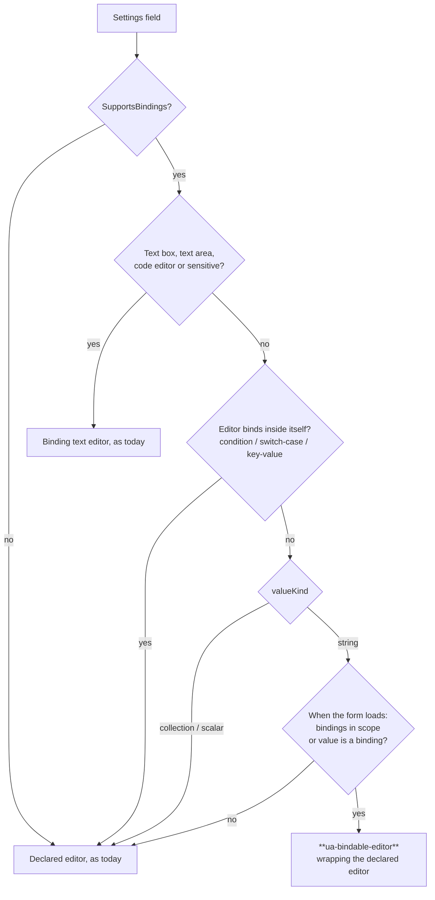
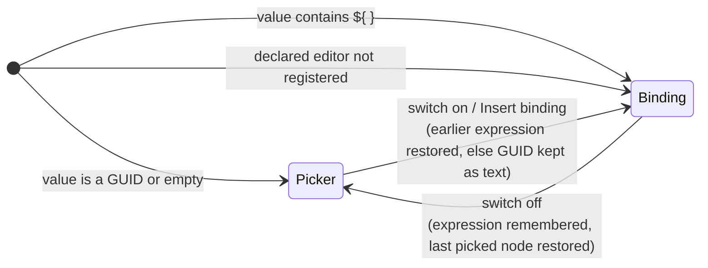

# Architecture

## Extension points

This extends **Automate's own settings form** and its **settings field descriptor**. It
registers one `propertyEditorUi` (the wrapper), one Automate picker `propertyEditorUi` for media
items, and one `propertyAction`. It adds no new CMS extension point, and no persistence or
Management API endpoint.

| Seam | Today (`v18/dev`) | What changes |
| --- | --- | --- |
| `ua-settings-form` `#resolveEditorAlias` (`settings-form.element.ts:185`) | Swaps text box, text area, code editor and sensitive field for their binding versions. Every other editor renders as declared, and `SupportsBindings` is ignored | Any other editor on a scalar `SupportsBindings` field is routed to the wrapper, which is told which editor to wrap |
| `EditableModelFieldDescriptor` (`Core/Settings/EditableModelSchema.cs`) | `PropertyType` is `[JsonIgnore]`, so the client can't tell a `string` from a `List<string>` | Gains `ValueKind` (`Scalar` / `Collection`), set by `EditableModelSchemaBuilder` from the existing `IsCollection` check |
| `UmbracoAutomate.PropertyEditorUi.Bindable` (`ua-bindable-editor`, from #443) | Only on the #443 branch | Becomes the single pick-or-bind wrapper |
| Core settings `[Field]` attributes | Content and media key fields are text boxes with bindings, or pickers without them | Each becomes a picker *and* `SupportsBindings = true` |

How `ua-settings-form` picks the editor for a field (the new branch is in bold):



Inside the wrapper, the mode comes from the value, and the switch moves between the two modes:



**Why the wrapper and not per-editor switches.** The switch is the same for every editor. #443
writes it once, around the editor's own manifest, so a Forms form picker or any third-party
picker gets it with no code of its own. #206 builds the switch into each picker. Every new
picker would have to repeat it, and if both PRs landed, a wrapped #206 picker would show two
switches.

### The contract

```csharp
namespace Umbraco.Automate.Core.Settings;

/// <summary>What shape of value a settings field holds.</summary>
public enum EditableModelValueKind
{
    /// <summary>A string. The only kind that can hold a ${ } binding in place of its value.</summary>
    String = 0,

    /// <summary>Any other single value: number, bool, Guid, DateTime, enum, or an object such as ConditionSet.</summary>
    Scalar = 1,

    /// <summary>Any collection other than string, such as List&lt;string&gt;, string[] or a list of rows.</summary>
    Collection = 2,
}

public sealed class EditableModelFieldDescriptor
{
    // …existing members…

    /// <summary>Whether the field holds a string, another single value or a collection. Derived from the property's CLR type.</summary>
    public EditableModelValueKind ValueKind { get; init; }
}
```

The descriptor is serialised as is, so `types.gen.ts` is regenerated to pick up `valueKind`.

A second contract makes a bound optional field fail loudly instead of silently falling back:

```csharp
public class EditableModelFieldAttribute
{
    // …existing members…

    /// <summary>
    /// When true, a ${ } binding on this field that resolves to an empty or whitespace value fails
    /// the step, instead of handing the action an empty string. Use it on optional fields where
    /// empty has a meaning of its own, such as "the root" for a parent key.
    /// </summary>
    public bool BindingMustResolve { get; set; }
}
```

`SettingsBindingResolver` already knows each property's attribute and its raw value before
resolving. When the raw value held a binding, the flag is set and the result is empty, it throws a
settings-binding exception naming the field. `ActionStepBody` already turns exceptions thrown
during settings setup into a recorded step failure (`ActionStepBody.cs:118-129`), so the run shows
the step as failed with that message. A field that was really left empty never had a binding, so it
still means "root".

### Which fields adopt it

The sibling convention is already set. Fields that pick content use CMS's
`Umb.PropertyEditorUi.DocumentPicker`, with `validationLimit` in `EditorConfig`
(`MoveContentSettings`, `CreateContentSettings`). Slice 1 follows that convention and adds
bindings:

| Group | Fields | Editor |
| --- | --- | --- |
| Content keys, today text boxes | Publish, Unpublish, Get Content, Get Content Property, Update Content Property, Notify Editor: `ContentKey` | `Umb.PropertyEditorUi.DocumentPicker`, max 1 (new) |
| Content keys, today pickers | Move Content: `ContentKey`, `TargetParentKey`. Create Content: `ParentKey` | unchanged, plus `SupportsBindings`. The two parents also get `BindingMustResolve` |
| Media items, today text boxes | Get Media, Get Media Property, Update Media Property: `MediaKey` | `Umb.Automate.MediaKeyPicker`, max 1, files only (new) |
| Media items, today a picker | Move Media: `MediaKey` | `Umb.Automate.MediaKeyPicker` with `folderFilter: filesAndFolders` (was `MediaEntityPicker`), plus `SupportsBindings` |
| Media parents (folders) | Create Media: `ParentKey`. Move Media: `TargetParentKey` | `Umb.PropertyEditorUi.MediaEntityPicker` unchanged, plus `SupportsBindings` and `BindingMustResolve` |

Why media needs its own picker: since CMS 17.3.0, `Umb.PropertyEditorUi.MediaEntityPicker`
can only select folders (CMS #21895, `UmbMediaPickerFolderFilter.FOLDERS_ONLY`). That's right for
a parent and wrong for an item. CMS has no other editor that stores a plain media key.
`MediaPicker3` stores objects. `Umb.Automate.MediaKeyPicker` is #206's media picker without
its switch: a thin `umb-input-media` honouring `validationLimit` and a `folderFilter` config
(`filesOnly` by default, `filesAndFolders` or `foldersOnly` when a field sets it). Files only is the
default, and Get Media, Get Media Property and Update Media Property use it. That's a deliberate
narrowing: these fields are for a media item, and keeping folders out of the picker keeps the
choice clean. The actions themselves do work on folders, including folder types with their own
properties, and a binding can still point at a folder. Move Media can move a folder, so its field
allows both.

> ASSUMPTION: Start Automation's `AutomationKey` (`Umb.Automate.AutomationPicker`) stays
> picker-only. Binding which automation to start isn't asked for, and it would bypass the
> picker's workspace scoping.

## Data model & persistence

None. Stored settings keep their shape: a picked node is a GUID string, as the actions already
parse it with `Guid.TryParse`, and a binding is a `${ }` string. The mode isn't stored. It comes
from the value, so existing automations need no migration.

Fields that move from a text box to `DocumentPicker` already hold a GUID string, which is what
`DocumentPicker` stores with max 1. They open with that node picked.

> ASSUMPTION: `DocumentPicker` with `validationLimit` max 1 stores a single GUID with no commas.
> That's what Move Content relies on today. A test should confirm it.

## Connected systems

- **Deploy (Deploy.Automate):** no change. The settings JSON keeps its shape, so any content
  references in it are exported and imported as before.
- **Version history / snapshots:** no change. Same stored shape.
- **Publish validation (`AutomationService.cs:383`, `:418`):** no change. These fields already
  accept a `${ }` string as text boxes, and the move/create fields accept a GUID string. A
  binding is only checked when the run resolves it, as for text fields today.
- **Run-time binding resolution (`SettingsBindingResolver`):** one addition, the
  `BindingMustResolve` check above. All adopters are `string` properties, which it already
  resolves.
- **Run view / step summaries:** no change. They show the stored string.
- **Localization:** one new term (`uaBindings_useBinding`, from #443) in `lang/en.ts`.
- **Acceptance tests (Playwright, #296):** new specs (see SPEC). This is the first core use of the
  wrapper, which #443 couldn't test.
- **Public C# API:** `ValueKind` and the enum are additive. #206's
  `Constants.EditorUiAliases.ContentKeyPicker` was never released, so dropping it is safe (see
  memory: shims only for released API). `MediaKeyPicker` takes its place on
  `Constants.EditorUiAliases` so packages can reuse it.

## Key decisions

1. **One wrapper (#443) owns the switch. #206's built-in switches are dropped.** Rejected:
   landing #206 as it is and adding its aliases to #443's "handles bindings itself" list. That
   leaves two implementations of one switch, and every future picker has to choose between them.
2. **Use CMS `DocumentPicker` for content keys, not an Automate content picker.** It's what the
   existing pickers in this codebase use. Rejected: #206's `Umb.Automate.ContentKeyPicker`, a
   second editor doing what the CMS one already does.
3. **Use an Automate picker for media items.** CMS has no editor that stores a plain media item
   key (decision 2's reasoning, reversed). This also fixes Move Media's `MediaKey`, which can
   only pick folders today.
4. **The server sends `valueKind`. Only `String` fields get the switch.** #443 guesses array vs
   string from `defaultValue`. A `List<string>` with a null default would then be stored as a
   bare `${ }` string, and deserializing that into a list throws (`SingleValueArrayConverterFactory`
   only flattens, it never wraps). Rejected: the client guess, and #443's `["${ expr }"]` array
   shape, which is dropped before it ships. `Collection` fields render their editor unwrapped,
   so multi-value pickers stay picker-only. That's the brief's assumption, and it leaves room for
   whole-list binding later by adding to the enum.
   Non-string single values (`Scalar`) are unwrapped too. A `${ }` string can't be deserialized
   into an `int`, `Guid`, enum or object, and bindings are only resolved on strings after
   deserialization (`SettingsBindingResolver.cs:49-53`). Wrapping them would offer a mode that
   fails at run time. Rejected: wrapping every single value and converting the resolved string to
   the target type, which is new server work with no adopter asking for it.
   Together with decision 9, these are the slice's server changes. Both are additive, against
   the brief's "no server change" assumption.
5. **The mode comes from the value, with the author's switch choice pinned for the session**
   (#443 behaviour). A `${ }` value opens in binding mode, anything else in the picker. Each mode
   remembers its last value while the step panel is open, so switching back and forth loses
   nothing: an expression comes back when you switch on, and a picked node when you switch off.
   Only the visible mode's value is stored. Rejected: a stored mode flag, which needs a
   migration and can disagree with the value. Also rejected: #443's clear-on-switch-off, which
   loses an expression to one accidental click.
6. **Editors that bind inside themselves stay a hard-coded skip list** (condition builder,
   switch-case builder, key/value editor, the binding text editors). Rejected: a manifest flag
   for third parties (#443 Q5), which no package needs yet.
7. **A wrapped editor gets the wrapper's Insert binding action, not the actions registered for
   its own alias** (#443 Q7). `umb-property` resolves property actions by the mounted editor's
   alias, which is the wrapper's. Accepted for slice 1, because the adopting pickers have no
   field-level actions we rely on. Revisit if a wrapped third-party editor needs its own.
8. **When the wrapped editor isn't registered** (its package was uninstalled), the field falls
   back to binding mode and shows the raw value, so the author isn't stuck with nothing to edit.
9. **A bound optional field must resolve to something** (`BindingMustResolve`). Otherwise a
   typo or a null output in a parent binding creates or moves content to the root with no error
   (`MoveContentAction.cs:119-122`, `CreateContentAction.cs:88`, `CreateMediaAction.cs:98`,
   `MoveMediaAction.cs:118`), because the evaluator turns a missing path into `""`. Opt-in rather
   than for every bindable field: an optional message that binds an optional output is legitimately
   empty. Rejected: falling back to the root with a run warning, which still moves the content.
10. **The form chooses an editor for a field once, when it loads, not on every render.** #443
   re-evaluates the routing on every value change. With nothing in scope but a stored binding,
   switching off or emptying the box makes the form swap the wrapper for the bare picker, which
   loses the switch and the remembered value, and a half-deleted `}` mounts the picker with the
   broken text.
11. **One branch.** Slice 1 continues on #443's branch (`v18/feature/bindable-picker-settings`),
   which takes over #206's field changes and media picker. #206 is closed in favour of it. Then
   it's ported to `v17/dev`. Rejected: rebasing #206 onto #443, two PRs for one behaviour.

> ASSUMPTION: The v17 port is close to a straight copy. `v17/dev` has the same settings
> classes, the key/value editor (#371) that #443's skip list imports, and CMS 17.6+, which has
> `umb-input-document`, `umb-input-media`, `umb-input-toggle` and the folders-only
> `MediaEntityPicker`. `umb-plan` should confirm this with a diff.
