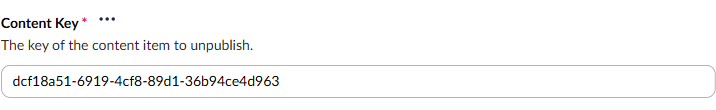
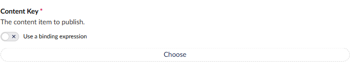
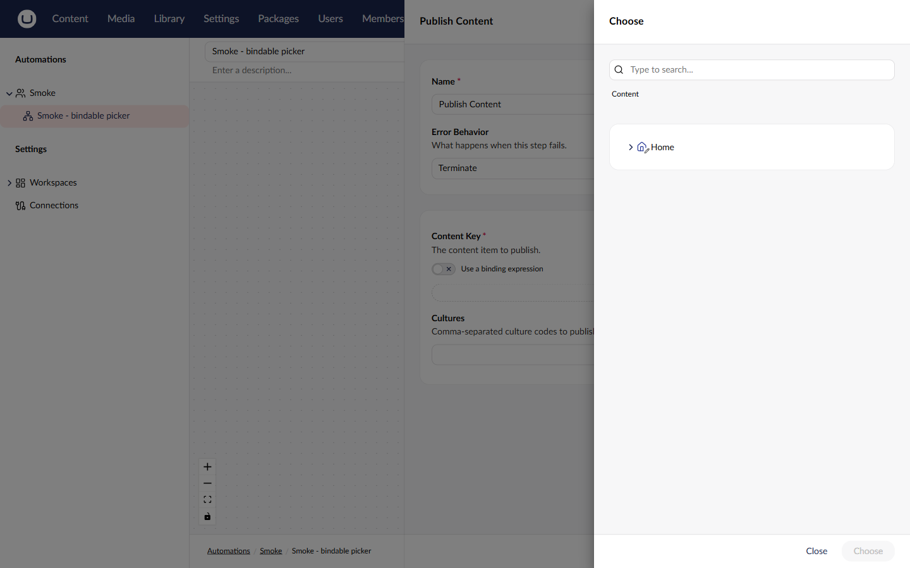
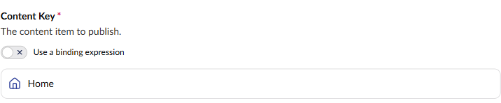
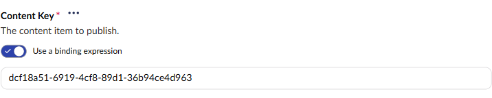
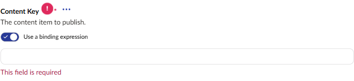
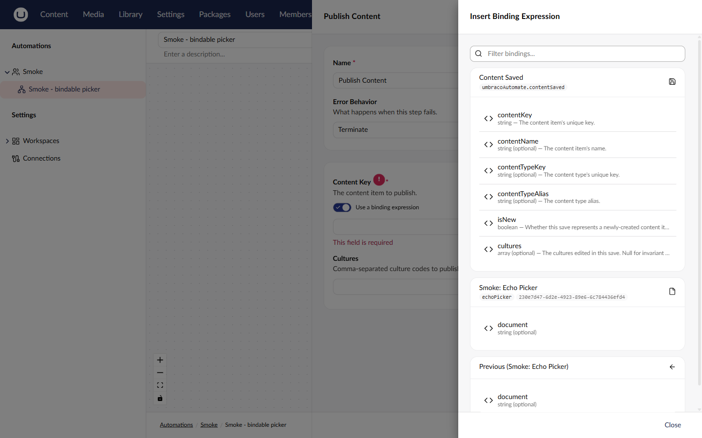
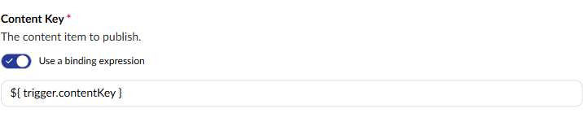
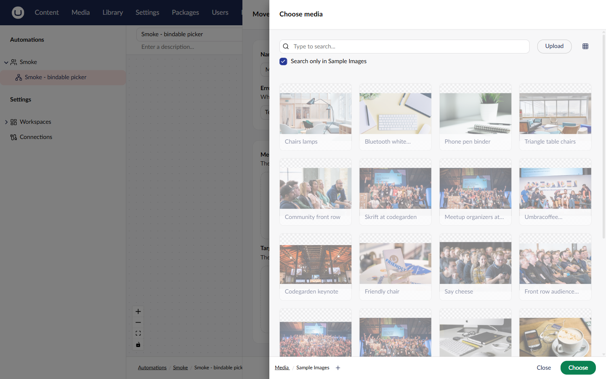
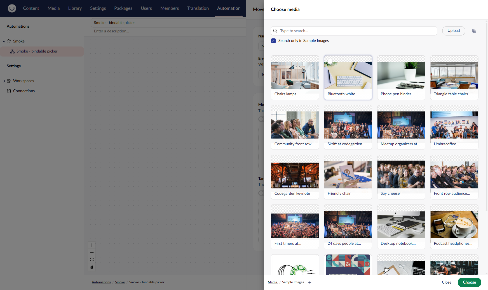

# Spec

## Management API surface

No new routes. One additive response field, and one run-time behaviour:

- Every settings field descriptor returned by the existing schema endpoints (action, trigger,
  control-flow and connection settings) includes `valueKind`: `"String"`, `"Scalar"` or
  `"Collection"`.
  - `string` gives `"String"`.
  - Other single values (numbers, `bool`, `Guid`, `DateTime`, enums, their nullable forms, and
    objects such as `ConditionSet`) give `"Scalar"`.
  - Any other `IEnumerable` (`List<string>`, `string[]`, lists of rows, dictionaries) gives
    `"Collection"`.
  - Existing fields and their values are unchanged.
- **Run time:** a field marked `[Field(BindingMustResolve = true)]` whose stored value holds a
  `${ }` binding that resolves to an empty or whitespace string fails the step. The run view shows
  the step as failed, with a message naming the field and saying its binding resolved to nothing.
  The action doesn't run. The same field left really empty (no binding) is passed through as
  today, so it still means "the root".

Enum values are PascalCase strings. That's the Management API's existing convention:
`JsonStringEnumConverter` with no naming policy (`UmbracoBuilderExtensions.ConfigureManagementApiJson`).
The property name is camelCase (`valueKind`). This was confirmed against the running site in T2.

## Frontend components

### `ua-settings-form`: routing

For each field, in order:

1. A `SupportsBindings` field using a text box, text area, code editor or sensitive field takes
   its binding version when bindings are in scope. This is unchanged.
2. A `SupportsBindings` field with `valueKind: "String"` and any other editor, except those that
   bind inside themselves (condition builder, switch-case builder, key/value editor), renders as
   `ua-bindable-editor` wrapping its declared editor. This applies when bindings are in scope, or
   when the stored value is a `${ }` string.
3. Everything else renders its declared editor, as today. That includes every
   `valueKind: "Scalar"` and `"Collection"` field, whatever its editor.

The form decides each field's editor **once, when its values are first loaded**, and doesn't
change it as the value changes. Switching off, emptying the box or deleting a `}` mid-edit never
swaps the wrapper for the bare picker. A field that was routed to the wrapper stays in it until
the panel is reopened.

### Screenshots

Captured 05-10-2026 on the v18 demo site, built from #443's branch
(`v18/feature/bindable-picker-settings`, `5d30338`). For the "after" shots, Publish Content's
`ContentKey` was pointed at `Umb.PropertyEditorUi.DocumentPicker` locally, as this design
specifies, and then reverted. Nothing was committed or saved to the automation.

**Today: a content key is a text box** (Unpublish Content, unchanged)



**After: picker mode, empty.** The switch sits above CMS's document picker.



**After: choosing a node** opens CMS's normal content tree modal.



**After: a node picked.** It's stored as the plain GUID and shown by name.



**After: switch on.** The picked GUID is kept as editable text.



**After: the mistake.** An empty required field in binding mode shows the required message.



**After: Insert binding** opens the same modal as text fields, with the trigger's and earlier
steps' outputs.



**After: binding mode with an expression**



**Today: Move Media → Media can only pick folders.** Every image is greyed out
(`MediaEntityPicker` is folders-only since CMS 17.3.0).



**After (T8): Move Media → Media uses `Umb.Automate.MediaKeyPicker` with `filesAndFolders`.**
The images can be selected. Captured from the branch build on 05-10-2026.



Not captured: the "nothing to bind to" state (no switch). No trigger's own settings have a
picker field to show it on. The mockup below covers it.

### Mockups

These are low-fidelity sketches, kept for states the screenshots don't cover.

**Publish Content → Content Key, today.** A text box with the Insert binding action. Picking a
node means copying its key from the content tree.

```
Content Key                                              [<>]
The key of the content item to publish.
┌──────────────────────────────────────────────────────────┐
│ 3f2a9c1e-7b4d-4e0a-9f21-5c8d2e6b1a40                     │
└──────────────────────────────────────────────────────────┘
```

**After: picker mode** (default for a GUID or an empty value)

```
Content Key                                              [<>]
The content item to publish.
( ○  ) Use a binding expression
┌──────────────────────────────────────────────────────────┐
│ 📄 Home                                    /Home     [×] │
└──────────────────────────────────────────────────────────┘
```

When the field is empty, the node card is replaced by the CMS picker's `[ Choose ]` button.

**After: binding mode** (switch on, or the value contains `${ }`)

```
Content Key                                              [<>]
The content item to publish.
(  ● ) Use a binding expression
┌──────────────────────────────────────────────────────────┐
│ ${ trigger.contentKey }                              [<>]│
└──────────────────────────────────────────────────────────┘
```

**After: nothing to bind to** (a trigger's own settings, or the first step with no trigger
outputs). There's no switch, just the picker.

```
Content Key
The content item to publish.
┌──────────────────────────────────────────────────────────┐
│ [ Choose ]                                               │
└──────────────────────────────────────────────────────────┘
```

**Move Media → Media: today vs after.** Today the picker modal only lets you select folders.
After, files can be selected too, and the field gains the switch.

```
Today                                After
┌───────────────────────────┐        ┌───────────────────────────┐
│ Select media              │        │ Select media              │
│  📁 Images        ✓ select │        │  📁 Images        ✓ select │
│   🖼 hero.jpg     (greyed) │        │   🖼 hero.jpg     ✓ select │
│   🖼 logo.png     (greyed) │        │   🖼 logo.png     ✓ select │
└───────────────────────────┘        └───────────────────────────┘
```

**A collection field** (for example `List<string>` with a multi-value picker) doesn't change.
It shows its editor with no switch, because whole-list binding is out of scope.

### `ua-bindable-editor`: behaviour

- **Picker mode:** renders the declared editor from its manifest and passes it `value`, `config`
  (its own `EditorConfig` entries), `mandatory`, `mandatoryMessage`, `readonly`, `name` and
  `dataSourceAlias`. The wrapped editor's own validation (for example `validationLimit` min 1)
  applies only in this mode.
- **Binding mode:** renders `ua-binding-text-box` with the same binding sources and the same
  Insert binding modal as text fields.
- **Switch:** a labelled toggle, "Use a binding expression", above the field. The label is fixed
  and the toggle shows on/off. The toggle can be operated with the keyboard.
  - It shows only when bindings are in scope or the value is already a binding, and never when
    the field is read-only.
  - **Off → on:** if an expression was entered earlier while this step panel was open, it's
    restored. Otherwise a literal string value (a picked GUID) is kept as editable text.
  - **On → off:** the expression is remembered. The picker then shows, in this order: the GUID
    in the box, if the box holds one; otherwise the last node picked while this panel was open;
    otherwise nothing. The picker looks up a GUID and shows that item by name. Any other text in
    the box, which is neither a binding nor a GUID, is dropped. The picker can't show it.
  - Remembered values live only in the open step panel. They're never saved. The stored value is
    always what the visible mode shows, so saving with the switch off stores no binding.
    Closing or reopening the panel forgets them.
  - The chosen mode holds while the step is open, even if the expression box is emptied.
- **Insert binding property action:** in binding mode it inserts at the caret. In picker mode it
  switches to binding mode, holding just the chosen expression, and remembers the picked node
  exactly as the switch does.
- **Mandatory:** in either mode, an empty value shows the field's required message. A non-empty
  `${ }` value counts as filled.
- **Missing editor:** if the declared editor isn't registered and the field was routed to the
  wrapper (bindings in scope, or a stored binding), it opens in binding mode with no switch,
  showing the stored value as text. With nothing in scope and no binding, the form renders the
  declared alias as it does today.
- **Value written:** in picker mode, exactly what the wrapped editor emits. In binding mode, the
  expression string. Nothing else is added to the stored settings.

### `Umb.Automate.MediaKeyPicker` (`ua-media-key-picker`)

- Renders `umb-input-media` with `min`/`max` from `validationLimit` (default max 1).
- Reads a `folderFilter` config entry: `filesOnly` (the default, so only files can be selected),
  `filesAndFolders` or `foldersOnly`. Move Media's `MediaKey` sets `filesAndFolders`.
- Stores the selected media key as a string, exactly as `umb-input-media` emits it.
- Has no binding switch of its own. Bindings come from the wrapper.
- Honours `readonly`.

### Adopting core fields

As listed in ARCHITECTURE "Which fields adopt it". Each field:

- In an automation step with a trigger or earlier step in scope, shows its picker and the switch.
- With a GUID stored (from before or after this change), opens in picker mode with that node
  shown by name.
- With `${ trigger.contentKey }` (or any `${ }`) stored, opens in binding mode showing the
  expression.
- With a picked node, stores the plain GUID, and the run acts on that node.
- With a binding, stores the expression, and the run acts on the node it resolves to (for
  example Find Content → Get Content Property bound to the found node's key).
- On a trigger's own settings, or a step with nothing in scope, shows the picker with no switch.
  The exception is a field that already holds a binding.

Move Media's `MediaKey` can pick a media file or a folder. Get Media, Get Media Property and
Update Media Property can only pick files.

The four optional parents (Create Content and Create Media `ParentKey`, and Move Content and
Move Media `TargetParentKey`) carry `BindingMustResolve`. A parent bound to something that
resolves to nothing fails the step instead of creating or moving content to the root.

### Backoffice UX check

- **Component:** CMS pickers (tree modal, node card with name and icon) for content and media
  parents. A thin Automate picker for media items, since CMS has none that fits. No plain inputs
  for node references.
- **First run:** an empty field shows the picker's own "Choose" button, with the switch above it
  when bindings are in scope. Nothing else is needed.
- **The mistake:** a binding that resolves to something that isn't a valid key fails the step at
  run time with the action's existing "not found / invalid key" message in the run view. This
  slice adds no design-time check of what a binding resolves to. That's a deliberate skip,
  because at design time there's no data to check against.
- **The wait:** loading the wrapped editor's element and a picked node's name use the CMS
  inputs' own loading states. Nothing new.
- **The finish:** a picked node shows as a node card, and an inserted binding shows as text in
  the expression box. Both are visible before saving.
- **The return:** reopening a step derives the mode from the saved value, so it opens how it was
  left. The session-pinned mode isn't kept across reloads, which is deliberate because the value
  already says it.

### Acceptance tests (Playwright)

- Publish Content: pick a node, save, reopen (picker mode, node shown), run (that node is
  published).
- Publish Content: switch on, insert `trigger.contentKey`, save, reopen (binding mode), run on a
  content trigger (the triggering node is published).
- Get Media: pick a media file (not a folder), run, and the output is that item.
- An automation saved before this change with a GUID in a content key opens in picker mode.
- A trigger's settings show no switch on a bindable picker field.
- Insert a binding, switch off, switch on: the same expression is back. Switch off and save:
  the stored value has no binding.
- Pick a node, switch on, insert a binding, switch off: the picked node is back.
- Pick node A, switch on, paste node B's GUID, switch off: node B is shown.
- Pick a node, then use Insert binding from picker mode, then switch off: the picked node is back.
- Nothing in scope, stored binding: switch off and back on, and the expression is back. The
  switch never disappears.
- Create Content with `ParentKey` bound to a path that doesn't exist: the step fails, and nothing
  is created at the root.
- Get Media Property's picker can't select a folder. Move Media's can.
- To capture during the build (T9) and decide what to show:
  - a GUID for a deleted node, and for a node in the recycle bin;
  - an old automation whose GUID is upper-case or in braces, which the run accepts but CMS's
    picker may show as "not found";
  - an author whose user group can't open the content or media tree.
